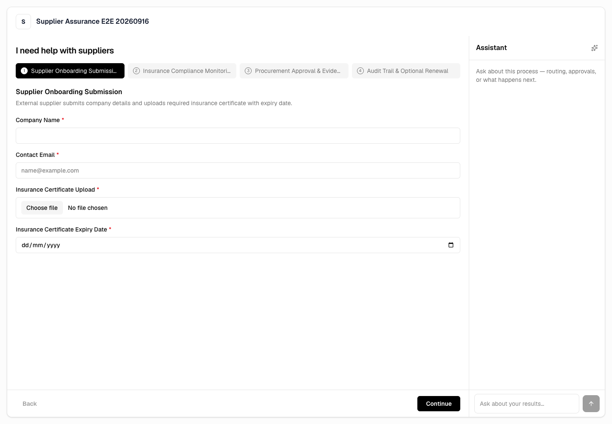
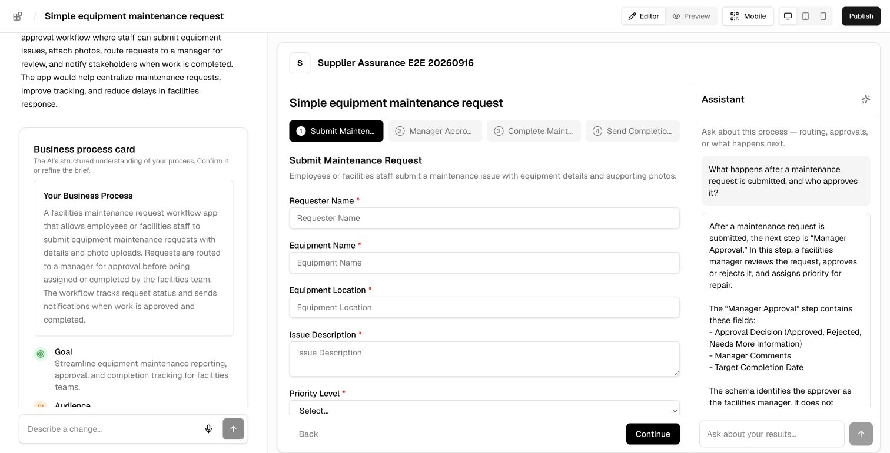

# UI show and tell

The active TenantInfra deployment preserves the generated application's intended
two-panel design. Workflow navigation, required inputs, document upload, and form
actions stay in the main panel; the Assistant and its composer stay in the right
panel. The image is a live hosted capture after a successful submission start,
not a static mock or Storybook fixture.

Open UX issues: none.

The local builder preview retains the same workflow/Assistant composition,
required inputs, step navigation and bottom action rail. This current
loopback capture complements the deployed-runtime image rather than replacing
its hosted receipt.
